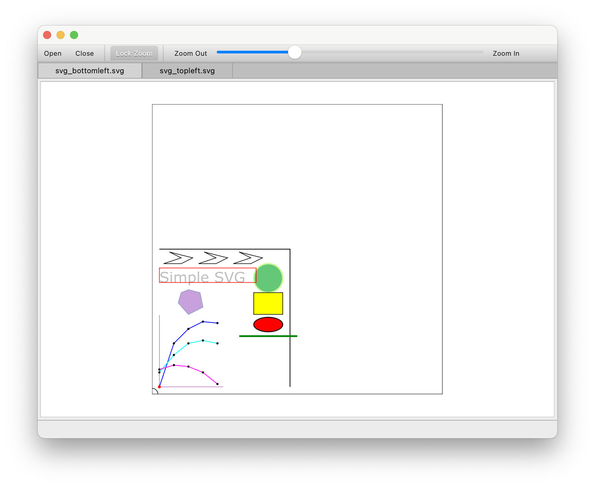

# file-monitor

This project contains source files obtained from the [Google Code Archive](https://code.google.com/archive/p/file-monitor/) as `file-monitor-2.1.0.tar.gz` from [downloads](https://code.google.com/archive/p/file-monitor/downloads) dating from 2012.

## License

As stated on the [Google Code Archive](https://code.google.com/archive/p/file-monitor/) page:
[License: GNU GPL v3](https://www.gnu.org/licenses/gpl-3.0.html).

## Purpose and usage

> As explained on the [Google Code Archive](https://code.google.com/archive/p/file-monitor/) page:

File viewer that automatically redraws files when they change on disk.

File Monitor is a cross-platform file viewer that automatically redraws files when they change on disk.

You can edit an HTML document in a simple text editor and watch it update in real-time using File Monitor.

If you are zoomed into an image and if that image changes on disk, it will be automatically updated with changes while staying zoomed into and the same part of the image.

If you are keeping track of 10 different log files, File Monitor will automatically switch to the most recently modified file and take you to those changes.

Currently supported file types are text, xml, html, svg, and raster image file formats (jpg, gif, png, bmp, etc).

## Modifications by [@rudifa](https://github.com/rudifa)

- build: add `CMakeLists.txt` and use it
- install: add `install` target to install the app to `/Applications/file-monitor.app`
- source files: update to build with `Qt 6.8.2` on a MacBook Pro arm64 running macOS Sequoia 15.3.1.
- main window: add `Lock Zoom` button to lock zoom level and position between file tabs

## Build with CMake

In the project directory, run:

```bash
mkdir build
cd build
cmake ..
make

```

## Run

In the `build` directory, run:

```bash
./file-monitor.app/Contents/MacOS/file-monitor
# or
open -a file-monitor.app
```

## Install

In the `build` directory, run:

```bash
make install
```

This copies the application files to /Applications/file-monitor.

## Example `file-monitor` display


